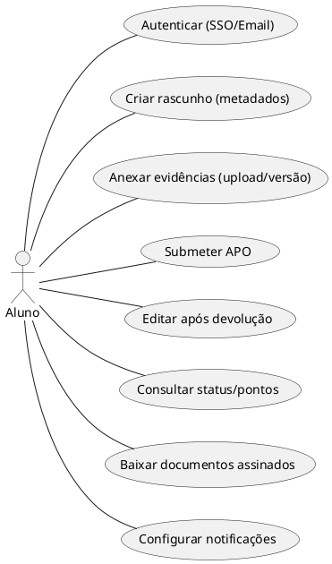
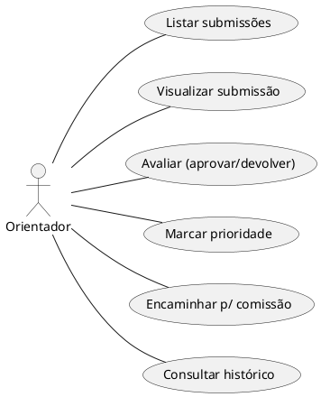
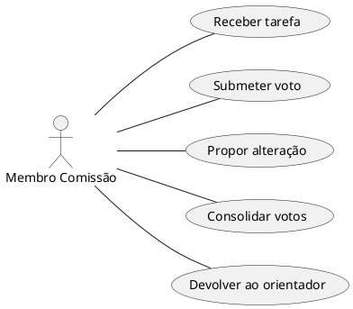
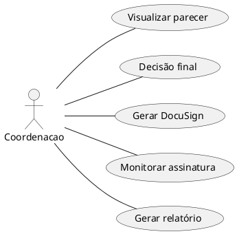
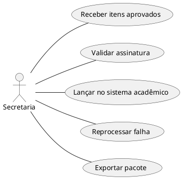
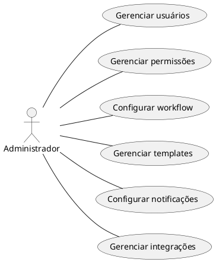

# APOFlow — Casos de Uso (Use Cases)

> Arquivo gerado em Markdown com diagramas PlantUML. Contém casos de uso por **papel** (recomendado) e diagramas UML para cada conjunto de atores.

---

## Índice

1. Visão geral
2. Legenda / Convenções
3. Casos de uso por papel (Aluno, Orientador, Comissão, Coordenação, Secretaria, Administrador)
4. Especificação de implementação (para cada UC)
5. Diagramas PlantUML

---

## 1. Visão geral

Este documento descreve os casos de uso funcionais principais do sistema APOFlow. Cada caso de uso tem um título, resumo curto e referências aos requisitos (quando aplicável). O objetivo é cobrir o dia-a-dia dos atores do sistema: alunos, orientadores, membros da comissão, coordenação, secretaria e administradores.

> Versão v2: casos de uso refinados em funcionalidades específicas, com especificação técnica para implementação (UI, API, DB, validações, permissões, critérios de aceitação).

---

## 2. Convenções e legendas

* UC-XXX: ID do caso de uso.
* Actor: papel do usuário que executa o UC.
* UI: componentes de interface sugeridos.
* API: sugestão de rota endpoint REST (HTTP + recurso).
* DB: entidades/tabelas mínimas envolvidas.
* Permissões: papel(s) que podem executar a ação.
* Logs: eventos auditáveis obrigatórios.
* CA: Critério de Aceitação (teste que valida a implementação).

---

## 3. Casos de uso por papel (detalhados)

Abaixo, casos de uso refinados para cada ator. Cada item remete à sua especificação na seção 4.

### 3.1 Aluno

* **UC-A-001: Registrar / Autenticar via SSO ou email+senha (RF-001)**
* **UC-A-002: Criar rascunho de APO (criar metadados)** — campos obrigatórios definidos; checklist automático (RF-002)
* **UC-A-003: Anexar evidências a um rascunho (upload seguro, versão)** — upload chunked, preview PDF, virus-scan (RF-002, RF-013)
* **UC-A-004: Submeter APO para avaliação** — validações antes do envio (checklist, tamanho, tipo) (RF-003)
* **UC-A-005: Responder a devolução: editar campos e reenviar versão** — histórico de versões (RF-002)
* **UC-A-006: Consultar painel pessoal de status e pontos acumulados** — cálculo dinâmico de pontos (RF-011)
* **UC-A-007: Baixar documento assinado e comprovante (pdf)** — após assinatura completa (RF-007, RF-009)
* **UC-A-008: Gerenciar preferências de notificação (opt-in/out)** (RF-010)

### 3.2 Orientador

* **UC-O-010: Receber e listar novas submissões de orientados (filtro/prioridade)** (RF-003)
* **UC-O-011: Abrir submissão e visualizar evidências inline (PDF viewer + comentários)** (RF-002)
* **UC-O-012: Avaliar submissão — aprovar / devolver / solicitar alteração** — registrar justificativa (RF-004)
* **UC-O-013: Marcar como "prioridade" ou atribuir tag/nota interna** — ajuda triagem (Usabilidade)
* **UC-O-014: Encaminhar à comissão (criar tarefa de votação)** — seta comissão e deadline (RF-005)
* **UC-O-015: Acompanhar histórico de interações com o orientado** (RF-009)

### 3.3 Comissão (cada membro)

* **UC-C-020: Receber tarefa de avaliação (designada pela comissão)** — votos individuais (RF-005)
* **UC-C-021: Submeter voto (aprovar / reprovar / sugerir alteração) com justificativa obrigatória**
* **UC-C-022: Propor alterações que geram nova versão (edição controlada)** — alteração menor (metadata) vs. alteração de evidência (nova versão de arquivo).
* **UC-C-023: Consolidar votos (coordenador da comissão ou automatizado)** — gerar resumo de parecer.
* **UC-C-024: Reabrir para orientador (devolver) com checklist de correção**

### 3.4 Coordenação

* **UC-CO-030: Visualizar resumo de votação e parecer consolidado** (RF-006)
* **UC-CO-031: Emitir decisão final (aprovar/reprovar/solicitar correção)** — voto de Minerva em empate (RF-006)
* **UC-CO-032: Iniciar geração do envelope de assinatura eletrônica (DocuSign)** — preparar payload e participantes (RF-007)
* **UC-CO-033: Validar assinaturas pendentes / forçar re-emissão (quando necessário)**
* **UC-CO-034: Gerar relatório/nota técnica antes do envio para secretaria** — anexo para secretaria (Usabilidade)

### 3.5 Secretaria

* **UC-S-040: Receber itens aprovados para arquivamento** — validar metadados e pacotes (RF-009)
* **UC-S-041: Validar comprovante de assinatura e gerar pacote final para arquivamento** (RF-007, RF-009)
* **UC-S-042: Executar lançamento no Sistema Acadêmico (API de integração), somente se soma de pontos >= 12** — idempotência e logs (RF-008)
* **UC-S-043: Reprocessar lançamentos com falha e registrar motivos**
* **UC-S-044: Exportar pacote institucional (zip) com metadados, PDFs e logs** (6.5)

### 3.6 Administrador

* **UC-AD-050: Criar/Editar/Desativar usuário (conta)** — vincular SSO/LDAP quando aplicável (RF-001)
* **UC-AD-051: Criar/Editar papéis e permissões granulares** — definir ações permitidas por papel (RF-012)
* **UC-AD-052: Definir/Editar workflow (etapas, atores obrigatórios, número de avaliadores)** — validar versões do workflow (6.4)
* **UC-AD-053: Criar/Editar templates de submissão e checklists** — habilitar por tipo de APO (6.3)
* **UC-AD-054: Configurar modelos de notificação e regras de envio** — placeholders e testes de envio (RF-010)
* **UC-AD-055: Monitorar integrações (DocuSign, Sistema Acadêmico) e testar conexões**

---

## 4. Especificação de Implementação - (por ator)

Abaixo estão as fichas completas para TODOS os casos de uso, organizadas por ator.

---

### 4.1 ALUNO

#### UC-A-001: Registrar / Autenticar

* **Pré-condição:** usuário não autenticado
* **Pós-condição:** sessão ativa
* **API:** POST /auth/login
* **DB:** users
* **Permissão:** público
* **Validação:** credenciais válidas / SSO
* **Logs:** login_success / login_fail
* **CA:** login válido redireciona para dashboard

#### UC-A-002: Criar rascunho de APO

* **Pré-condição:** autenticado
* **Pós-condição:** draft salvo
* **API:** POST /drafts
* **DB:** drafts
* **Validação:** título obrigatório
* **Logs:** draft_created
* **CA:** draft aparece no painel

#### UC-A-003: Anexar evidências

* **API:** POST /attachments
* **Validação:** tipo (PDF/DOCX/PNG/JPG), tamanho ≤100MB
* **Logs:** file_uploaded
* **CA:** arquivo aparece e pode ser visualizado

#### UC-A-004: Submeter APO

(DETALHADO — já descrito acima)

#### UC-A-005: Editar após devolução

* **API:** PUT /drafts/{id}
* **Logs:** draft_updated
* **CA:** nova versão criada

#### UC-A-006: Consultar status/pontos

* **API:** GET /dashboard
* **DB:** submissions
* **CA:** pontos atualizados corretamente

#### UC-A-007: Baixar documentos

* **API:** GET /documents/{id}
* **CA:** download funcional

#### UC-A-008: Preferências notificação

* **API:** PUT /users/preferences
* **CA:** sistema respeita opt-in/out

---

### 4.2 ORIENTADOR

#### UC-O-010: Listar submissões

* **API:** GET /submissions?orientador_id=
* **CA:** lista filtrada corretamente

#### UC-O-011: Visualizar submissão

* **API:** GET /submissions/{id}
* **CA:** arquivos renderizam

#### UC-O-012: Avaliar submissão

(DETALHADO — já descrito acima)

#### UC-O-013: Marcar prioridade

* **API:** PATCH /submissions/{id}/priority
* **CA:** flag visível no painel

#### UC-O-014: Encaminhar comissão

* **API:** POST /submissions/{id}/forward
* **CA:** comissão recebe tarefa

#### UC-O-015: Histórico

* **API:** GET /submissions/{id}/history
* **CA:** histórico completo exibido

---

### 4.3 COMISSÃO

#### UC-C-020: Receber tarefa

* **API:** GET /tasks
* **CA:** tarefa visível

#### UC-C-021: Submeter voto

* **API:** POST /votes
* **Validação:** justificativa obrigatória
* **CA:** voto registrado

#### UC-C-022: Propor alteração

* **API:** PUT /submissions/{id}
* **CA:** nova versão criada

#### UC-C-023: Consolidar votos

* **API:** GET /votes/summary
* **CA:** resultado correto

#### UC-C-024: Devolver orientador

* **API:** POST /submissions/{id}/return
* **CA:** status atualizado

---

### 4.4 COORDENAÇÃO

#### UC-CO-030: Visualizar parecer

* **API:** GET /submissions/{id}/summary
* **CA:** dados consolidados

#### UC-CO-031: Decisão final

* **API:** POST /decision
* **CA:** status atualizado corretamente

#### UC-CO-032: Gerar DocuSign

(DETALHADO — já descrito acima)

#### UC-CO-033: Monitorar assinatura

* **API:** GET /envelopes
* **CA:** status atualizado

#### UC-CO-034: Gerar relatório

* **API:** POST /reports
* **CA:** PDF gerado

---

### 4.5 SECRETARIA

#### UC-S-040: Receber itens

* **API:** GET /approved
* **CA:** lista correta

#### UC-S-041: Validar assinatura

* **API:** GET /envelopes/{id}
* **CA:** status completo

#### UC-S-042: Lançar sistema acadêmico

(DETALHADO — já descrito acima)

#### UC-S-043: Reprocessar falha

* **API:** POST /reprocess
* **CA:** retry executado

#### UC-S-044: Exportar pacote

* **API:** GET /export
* **CA:** zip gerado

---

### 4.6 ADMINISTRADOR

#### UC-AD-050: Gerenciar usuários

* **API:** CRUD /users
* **CA:** usuário criado/editado

#### UC-AD-051: Gerenciar permissões

* **API:** CRUD /roles
* **CA:** permissões aplicadas

#### UC-AD-052: Configurar workflow

* **API:** PUT /workflow
* **CA:** fluxo atualizado

#### UC-AD-053: Templates

* **API:** CRUD /templates
* **CA:** template disponível

#### UC-AD-054: Notificações

* **API:** PUT /notifications
* **CA:** envio funcionando

#### UC-AD-055: Integrações

* **API:** GET/POST /integrations
* **CA:** conexão validada

---

## 5. PlantUML (diagramas atualizados v2 — granular)

### 5.1 Diagrama — Aluno

### 5.2 Diagrama — Orientador

### 5.3 Diagrama — Comissão

### 5.4 Diagrama — Coordenação

### 5.5 Diagrama — Secretaria

### 5.6 Diagrama — Administrador

---

## 6. Notas e correlação com RFs

- Caso hajam quaisquer dúvidas sobre o projeto, por favor contatar nosso tech lead - 10427372@mackenzista.com.br

